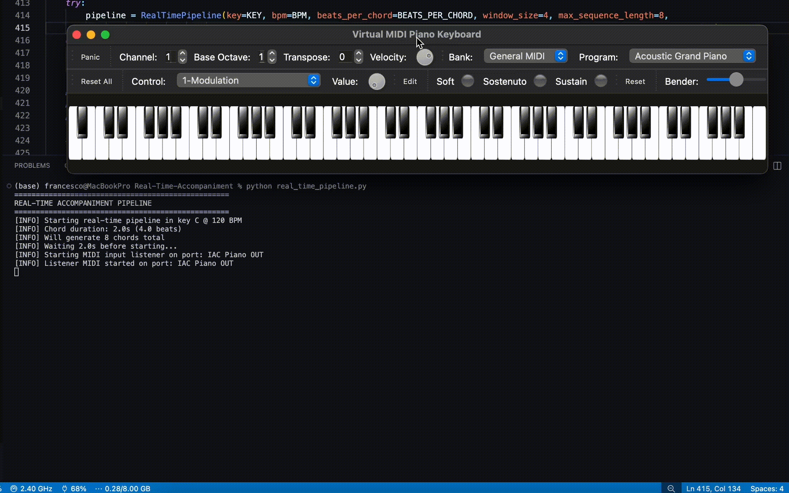

# Real-Time-Accompaniment

A real-time intelligent accompaniment system that listens to your playing and generates harmonically appropriate chords.

<div align="center">
   
### 🎥 Live Demo

---



</div> 


> ## 🚧 Work in Progress!
>
> This repository will host an AI-powered **Real-Time Accompaniment Generation** system that creates dynamic musical accompaniments on-the-fly. <br>
> The system will analyze live audio input played by a lead instrument (voice, piano melody, electric guitar, ...) and generate appropriate musical accompaniment in real-time. <br>
> Currently working on it, so feel free to **star** ⭐️ the repo to stay updated!

## 🔭 Overview

This system uses two prediction pipelines:
1. **Chord-based prediction** (`HarmonyRules`): Analyzes previous chord progressions
2. **Note-based prediction** (`NotesHarmonyRules`): Analyzes the notes you play and predicts chords using functional harmony theory (Tonic-Subdominant-Dominant)


And runs in real-time with multiple threads:
- **Timing thread**: Predicts and schedules chords
- **Playback thread**: Plays chords at the right time
- **MIDI listener thread**: Captures input notes from your performance
- **Metronome thread** (optional): Provides rhythmic click track

## 🥳 Features

- 🎹 Real-time chord accompaniment generation
- 🎵 Metronome with configurable empty bars count
- 🎼 Double pipeline: considering chords sequences first and refining with notes sequences
- ⚙️ Configurable BPM, time signature, key, and many more parameters
- 📊 Exponential weighting for recent notes
- 🔄 Harmonic role-based transitions (T→S→D→T)

## 🛠️ Usage: MIDI Routing Setup

This system requires proper MIDI routing between input, processing, and audio output:

### macOS Setup (Recommended)

1. **Create virtual MIDI ports** using Audio MIDI Setup:
   - Open `/Applications/Utilities/Audio MIDI Setup.app`
   - Window → Show MIDI Studio
   - Double-click "IAC Driver"
   - Create two ports: `IAC Piano IN` (output from Python) and `IAC Piano OUT` (input to Python)

2. **Choose your input setup**:

   **Option A: Virtual Keyboard (VMPK)**
   
   - Download and install [VMPK](https://vmpk.sourceforge.io/)
   - Configure VMPK:
     - **MIDI OUT**: `IAC Piano OUT` (sends your playing to Python)
     - **MIDI IN**: `IAC Piano IN` (receives accompaniment from Python to display notes)
   - Configure Synth (e.g., SimpleSynth, Surge XT, ...):
     - Listen to **both** `IAC Piano OUT` AND `IAC Piano IN`
     - This allows the synth to play both your notes and the generated accompaniment
   
   **Option B: Physical MIDI Keyboard**
   
   - Connect your MIDI keyboard via USB
   - Configure Python script:
     - `INPUT_PORT = 'Your Keyboard Name'` (e.g., 'Digital Piano', 'USB MIDI Keyboard')
     - `OUTPUT_PORT = 'IAC Piano IN'`
   - Configure Synth (e.g., SimpleSynth, Logic Pro):
     - Listen to `IAC Piano IN` if the physical keyboard produces sound, otherwise also add `Your Keyboard Name`

#### ❓ Why This Setup?

VMPK cannot simultaneously:
- Send MIDI OUT to Python (`IAC Piano OUT`)
- Receive MIDI IN from Python (`IAC Piano IN`) for audio playback
- Play those MIDI events

So we use a synth to intercept those channels and play the notes.


## 📂 Project Structure

```
├── real_time_pipeline.py     # Main pipeline orchestration
├── chord.py                   # Chord representation & MIDI generation
├── harmony_rules.py           # Chord-based prediction engine
├── notes_harmony_rules.py     # Note-based prediction engine
├── midi_listener.py           # Real-time MIDI input capture
└── utils.py                   # Helper functions
```

## 📬 Stay Updated

Development is actively ongoing. Hope you are as excited as I am!
